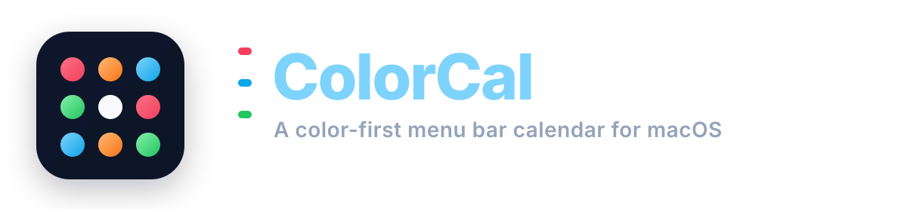
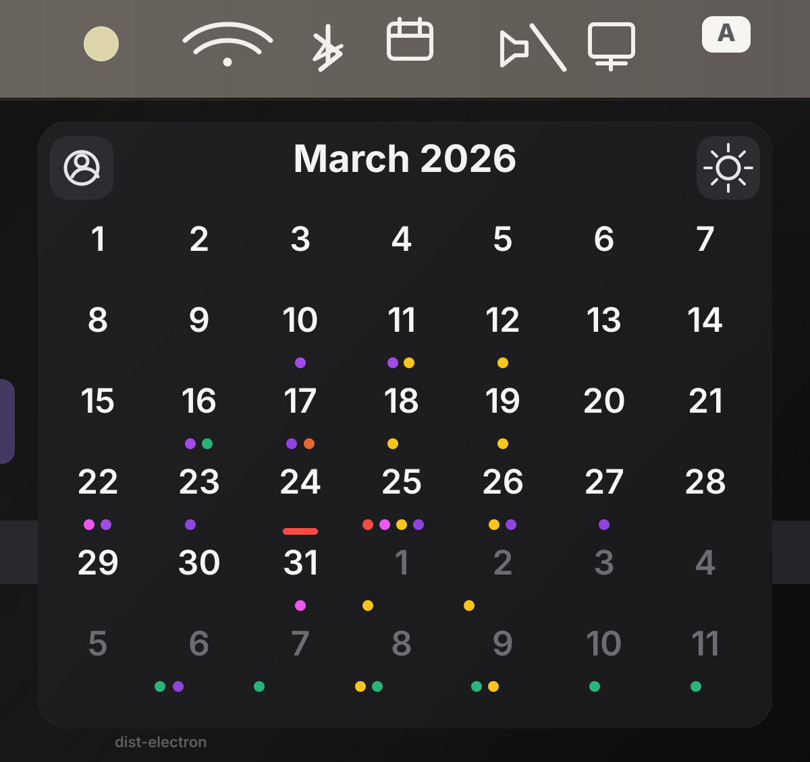
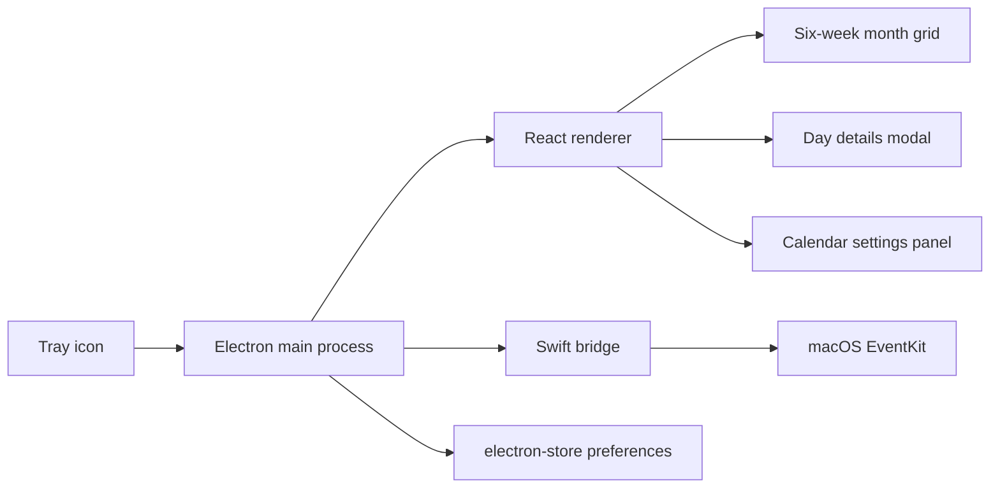

<p align="center">
  
</p>

<p align="center">
  <strong>A color-first macOS menu bar calendar.</strong><br />
  Tiny footprint, native calendar data, six weeks of signal at a glance.
</p>

<p align="center">
  
  
  
  
  
</p>

<p align="center">
  
</p>

## Glanceable By Design

> A good calendar utility should feel like peripheral vision, not a second inbox.
> ColorCal lives in the menu bar, reads from your real macOS calendars, and turns the month into a clean field of color you can understand in a second.

## Overview

ColorCal is a tray-first desktop app for macOS built with Electron, React, TypeScript, and a small native Swift bridge to EventKit.
Instead of opening a full calendar app just to orient yourself, ColorCal keeps a compact six-week view in the menu bar and shows which calendars are active on each day through color-coded dots.

The current build focuses on fast read-only awareness:

- Open the calendar from the menu bar.
- Scan a six-week month grid instantly.
- Swipe horizontally to move between months.
- Click any day to see that day's events.
- Toggle calendars on or off without touching your system setup.
- Override dot colors locally so the mini view stays legible.

## What Makes It Nice

| Feature | What it does |
| --- | --- |
| Menu bar native feel | The app hides the dock icon, opens as a frameless popover, stays lightweight, and dismisses itself when focus leaves the window. |
| Six-week color map | Every month view is a fixed 7x6 grid, making the UI predictable and very fast to scan. |
| Real calendar data | Events come from macOS EventKit, not a duplicated sync layer. |
| Read-only by default | ColorCal reads calendars and events, but does not edit or write back to Calendar.app. |
| Fast daily drill-down | Clicking a day opens a modal with all-day events first and timed events sorted chronologically. |
| Local customization | Calendar visibility and dot colors are stored locally with `electron-store`. |
| Smart grouping | Settings try to group calendars into buckets like iCloud, Google, and subscribed calendars for a more native-feeling list. |

## How It Works



## Current Behavior

ColorCal currently behaves like this:

- The tray icon toggles the window on both left-click and right-click.
- The month view starts on Sunday and always renders a six-week grid.
- Horizontal wheel or trackpad gestures move between months.
- Clicking a day opens an event list for that day.
- Pressing `Escape` closes the day modal first, then the settings panel.
- The settings panel lets you enable or disable calendars and change the dot color used inside ColorCal.
- Calendar access is requested through EventKit the first time the native bridge runs.

## Stack

- Electron for the desktop shell and tray integration
- React for the renderer UI
- TypeScript across Electron and renderer code
- `date-fns` for calendar math and formatting
- `lucide-react` for the compact UI icons
- `electron-store` for persisted preferences
- Swift + EventKit + AppKit for native macOS calendar access

## Getting Started

### Requirements

- macOS
- Node.js 18 or newer
- Xcode Command Line Tools or another working Swift toolchain

### Install

```bash
npm install
```

### Run In Development

```bash
npm run dev
```

On first use, ColorCal will compile the native Swift bridge if needed and then ask macOS for calendar permission.

If you previously denied access, re-enable it here:

`System Settings -> Privacy & Security -> Calendars`

### Build

```bash
npm run build
```

This runs TypeScript compilation, builds the renderer, bundles Electron, and packages the app with `electron-builder`.

## Project Structure

```text
.
├── electron/
│   ├── main.ts                 # Tray app, BrowserWindow, IPC handlers
│   ├── preload.ts              # Safe renderer API exposed on window.colorcal
│   ├── eventkitBridge.ts       # Swift bridge launcher + auto-rebuild logic
│   └── settings.ts             # Local preference persistence
├── native/
│   └── colorcal-eventkit-bridge/
│       ├── Package.swift
│       └── Sources/ColorCalBridge/main.swift
├── src/
│   ├── App.tsx
│   ├── components/
│   │   ├── SixWeekGrid.tsx     # Month grid and month navigation
│   │   ├── DayEventsModal.tsx  # Event list for a selected day
│   │   └── SettingsPanel.tsx   # Calendar toggles and local color overrides
│   └── types/colorcal.ts
└── build/
    └── trayTemplate.png        # Tray icon asset used by Electron
```

## Native Bridge Notes

The Swift bridge exposes three core commands:

- `list-calendars`
- `events-by-day`
- `events-for-day`

`electron/eventkitBridge.ts` checks whether the compiled binary is older than `main.swift` or `Package.swift` and rebuilds it automatically when necessary. That keeps the Electron app simple while still using Apple's real calendar APIs under the hood.

## Screenshot

The README hero image now lives at `docs/images/colorcal-screenshot.svg`.
If you later want to replace it with the exact raster export, use `docs/images/colorcal-screenshot.png` and update the top `` reference.

## Platform Scope

ColorCal is currently a macOS-first project. The calendar integration depends on EventKit and AppKit, so the app is not functionally cross-platform yet even though the packaging template still contains Windows and Linux targets.

## Shipping Notes

Before distributing a release, you will probably want to update the template metadata in `package.json` and `electron-builder.json5`, especially:

- package name
- version
- `appId`
- `productName`

## Why This Repo Exists

Most calendar tools ask for your full attention.
ColorCal aims for the opposite: a tiny, ambient interface that helps you answer three quick questions without context switching:

1. How busy is this month?
2. Which calendar is driving that day?
3. What exactly is on this date?

That is the entire mood of the project.
